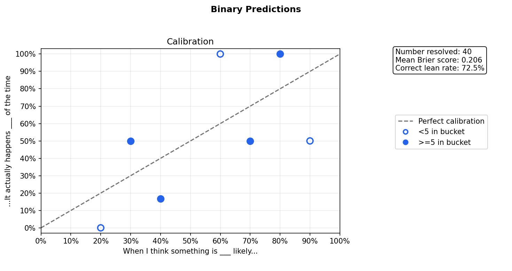
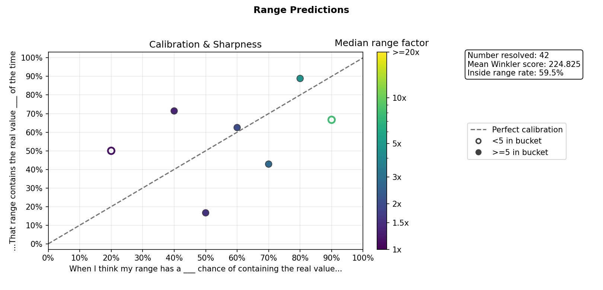

# Predlog

Predlog is a local-first command-line prediction journal for tracking personal probabilistic forecasts. It helps you:
- Log predictions
- Resolve them later
- View your prediction stats, and 
- Generate your calibration plots 

The problem Predlog solves is that prediction skill is hard to improve from memory alone. By keeping forecasts, outcomes, scores, and calibration plots in one small SQLite-backed CLI, Predlog makes it easier to practice forecasting deliberately and notice where you are overconfident, underconfident, or improving.

This tool will help you *get started* with probabilistic forecasting. 

## Usage

Predlog is managed with `uv`. To install it from GitHub into a `uv` project:

```bash
uv add "git+https://github.com/russluber/predlog.git"
```

Then verify that the command is available:

```bash
uv run predlog --help
```

If you are working from a local clone of this repository instead, use the same `uv run predlog ...` commands from the repository root.

### Log Predictions

Predlog enables you to log predictions for two types of questions:
1. Binary prediction questions - questions where the answer is either yes or no.
2. Numerical range prediction questions - questions where the answer is a positive number.

Log a binary question and your prediction:

```bash
uv run predlog binary "Will it rain in San Diego tomorrow (YYYY-MM-DD)?" --prob 30
```

This records a forecast stating that you think there's a 30% chance of rain in San Diego tomorrow. 

Binary probabilities must be one of `10, 20, 30, ..., 90`. Predlog intentionally uses 10-point increments to reduce false precision while you build calibration skill.

Log a range question and your prediction:

```bash
uv run predlog range "How many people will attend my presentation at the conference on YYYY-MM-DD?" --low 5 --high 36 --conf 80
```

This records a forecast stating that you're 80% *confident* that there will be between 5 and 36 attendees (inclusive) for your conference presentation on the indicated date.

Range confidence must also be one of `10, 20, 30, ..., 90`. The goal is to make each confidence choice meaningfully different instead of pretending that a beginner (like you) can reliably distinguish between, say, 68% and 74%.

Range predictions must have `--low` greater than zero. This keeps numerical ranges on a positive scale so Predlog can compare sharpness with range factors such as `1.5x` or `2x`. If zero is a real possibility, use a binary prediction for whether the value will be nonzero, then a positive range prediction for the conditional amount.

### List Predictions

Show every logged prediction:

```bash
uv run predlog list
```

Show only your open predictions i.e., predictions that haven't resolved yet:

```bash
uv run predlog list open
```

Show only your resolved predictions:

```bash
uv run predlog list resolved
```

### Delete Predictions

Delete an open prediction by ID (prediction ID found by listing):

```bash
uv run predlog delete 12
```

Resolved predictions are protected because they affect your scores and calibration history. To delete one anyway, use `--force`:

```bash
uv run predlog delete 12 --force
```

### Resolve Predictions

Resolve predictions interactively:

```bash
uv run predlog resolve
```

Or resolve directly by ID:

```bash
uv run predlog resolve 1 --yes
uv run predlog resolve 2 --no
uv run predlog resolve 3 --actual 28
```

Binary predictions use `--yes` or `--no`. Range predictions use `--actual` with the observed numerical value.

### View Stats

Show summary statistics for resolved predictions:

```bash
uv run predlog stats
```

Here's a trimmed example output of this command:

----

**Binary predictions**

Number of resolved predictions: 40  
Mean Brier score: 0.206  
Correct lean rate: 72.5 percent

**Binary calibration**

| Bucket | Count | Observed event rate | Calibration gap | Evidence | Feedback |
|---:|---:|---:|---:|---|---|
| 20% | 3 | 0.0% | -20.0% | sparse | Not enough data |
| 30% | 8 | 50.0% | +20.0% | enough | Predicted too low |
| 70% | 10 | 50.0% | -20.0% | enough | Predicted too high |

**Range predictions**

Number of resolved predictions: 42  
Mean Winkler score: 224.825  
Containment rate: 59.5 percent

**Range sharpness**

Median range factor: 2.00x

**Range calibration**

| Confidence | Count | Inside range rate | Calibration gap | Median range factor | Evidence | Feedback |
|---:|---:|---:|---:|---:|---|---|
| 40.0% | 7 | 71.4% | +31.4% | 1.35x | enough | Too wide |
| 60.0% | 8 | 62.5% | +2.5% | 2.00x | enough | About right |
| 80.0% | 9 | 88.9% | +8.9% | 4.50x | enough | Too wide |


----

Your exact numbers will differ, and a bucket appears only after you have resolved at least one prediction in that bucket.

For binary predictions, Predlog reports the number of resolved predictions, mean Brier score, correct lean rate, and calibration by probability bucket. For range predictions, it reports the number of resolved predictions, mean Winkler score, containment rate, calibration by confidence level, and sharpness.

Stats include non-empty calibration tables. These show the bucket count, observed rate, calibration gap, and whether the bucket is still sparse or has enough evidence according to Predlog's 5-forecast threshold.

To see a short glossary of the stats terminology in the CLI:

```bash
uv run predlog explain stats
```

This explains terms like mean Brier score, correct lean rate, observed event rate, containment rate, and median range factor without leaving the terminal.

#### Metrics

The main binary metrics are:

- **Mean Brier score**: average error for yes/no probability forecasts. Lower is better; `0.000` is perfect, while `0.250` is roughly what you get from always saying 50 percent.
- **Correct lean rate**: how often your yes/no lean was right. Forecasts above 50 percent lean yes, forecasts below 50 percent lean no, and 50 percent forecasts are ignored.
- **Bucket**: the predicted chance you chose, such as 30%, 70%, or 90%.
- **Observed event rate**: how often the event actually happened in that bucket.
- **Calibration gap**: observed event rate minus the bucket probability. A negative gap means the event happened less often than you predicted; a positive gap means it happened more often than you predicted.

The main range metrics are:

- **Mean Winkler score**: average interval forecast score. Lower is better. It rewards narrower intervals when they contain the actual value and penalizes misses, especially misses from high-confidence ranges.
- **Containment rate**: how often the actual value landed inside your predicted interval.
- **Median range factor**: typical multiplicative spread of your range intervals. For example, `[80, 120]` has range factor `1.5x` because `120 / 80 = 1.5`; smaller values mean sharper, more specific ranges.
- **Inside range rate**: the bucket-level containment rate.
- **Calibration gap**: inside range rate minus confidence. A negative gap suggests your ranges may be too narrow or overconfident; a positive gap suggests they may be too wide or underconfident.

In short, binary calibration asks whether each probability `bucket` matches the `observed event rate`. Range calibration asks whether `confidence` matches `inside range rate`. The `Evidence` column is `sparse` below 5 resolved predictions in a bucket and `enough` at 5 or more. The `Feedback` column waits for enough evidence, then gives a plain-language interpretation such as `About right`, `Predicted too high`, `Too narrow`, or `Too wide`.

### Generate Plots

Create a binary calibration plot:

```bash
uv run predlog plot binary
```

#### Example Binary Calibration Plot



When you start using Predlog, your binary calibration plot will probably look something like this after logging and resolving a few predictions. The goal is always to get your calibration data points as close to the perfect calibration line as possible over time.

There are a few things to point out in this example. Some data points might be missing. That means you haven't logged and resolved forecasts in that probability bucket. Some data points might be hollow. That just means you should trust those data points less because you've only logged and resolved less than 5 predictions for that probability bucket. 

Most importantly, if your data point is below the perfect calibration line, then you're overconfident for that probability bucket. If your data point is above, then you're underconfident for that probability bucket.

Create range calibration and sharpness plot:

```bash
uv run predlog plot range
```

#### Example Range Calibration Plot



Your range calibration plot works similarly, but each data point represents a confidence bucket for numerical ranges. If a point is below the perfect calibration line, then the real value landed inside your ranges less often than your stated confidence, which suggests your ranges were too narrow or overconfident. If a point is above the line, then the real value landed inside more often than expected, which suggests your ranges may have been too wide or underconfident. Hollow points again mean fewer than 5 resolved range predictions in that bucket, so treat them as early evidence rather than a firm conclusion.

The color of each point shows sharpness using median range factor. A smaller range factor means a tighter, more specific range. For example, `[80, 120]` has a range factor of `1.5x` because the upper bound is 1.5 times the lower bound. Darker points are sharper; lighter points are wider. Ideally, your points move closer to the perfect calibration line over time while staying as sharp as the question reasonably allows.

Generated plots are saved under Predlog's plots directory. Use `where` to see the exact paths:

```bash
uv run predlog where
```

The binary calibration plot compares predicted probability buckets against actual event rate. The range plot keeps calibration as the main view: marker position shows inside range rate, while marker color shows median range factor, with smaller/darker markers meaning sharper intervals. The range-factor color scale is log-scaled and capped at `>=20x` so plots remain comparable over time. Hollow markers mean a bucket has fewer than 5 resolved forecasts, and filled markers mean it has at least 5.

### Data Location

Predlog is local-first. By default it stores data under your home directory:

```text
~/.predlog/
~/.predlog/predlog.db
~/.predlog/plots/
```

On Mac and Linux, `.predlog` is a hidden folder because its name starts with a dot. The `predlog.db` file contains your prediction journal, and the `plots` directory contains generated PNG files.

Use `where` to see the exact paths Predlog is using:

```bash
uv run predlog where
```

To use a different location, set the `PREDLOG_HOME` environment variable. This is useful for demos, experiments, or keeping multiple separate prediction journals.

For one command in bash or zsh:

```bash
PREDLOG_HOME=/tmp/predlog-demo uv run predlog where
```

For one command in fish:

```fish
env PREDLOG_HOME=/tmp/predlog-demo uv run predlog where
```

For the current fish terminal session:

```fish
set -gx PREDLOG_HOME /tmp/predlog-demo
uv run predlog where
```

Unset it in fish with:

```fish
set -e PREDLOG_HOME
```

If `PREDLOG_HOME` is not set, Predlog uses the default `~/.predlog` location.


## References and Inspiration

Predlog is inspired by forecasting and calibration tools, scoring rules, and writing about probabilistic thinking:

- [Superforecasting](https://www.penguinrandomhouse.com/books/227815/superforecasting-by-philip-e-tetlock-and-dan-gardner/) - the book that spawned my interest in forecasting
- [The Scout Mindset](https://www.penguinrandomhouse.com/books/555240/the-scout-mindset-by-julia-galef/) - relevant chapter 6
- [Calibrate Your Judgment](https://www.clearerthinking.org/tools/calibrate-your-judgment) - great tool
- [Metaculus](https://www.metaculus.com/) - forecasting platform; its FAQ was really helpful
